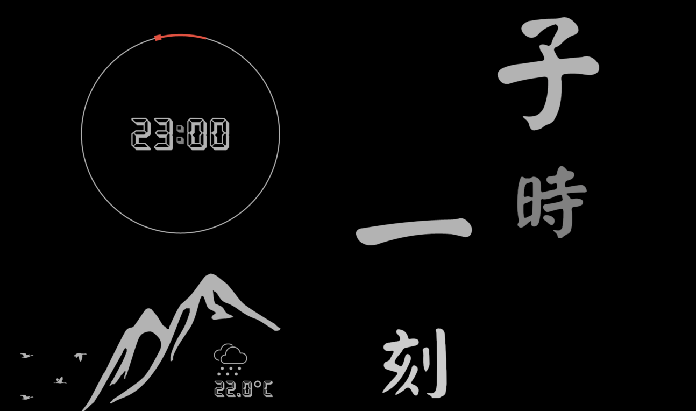
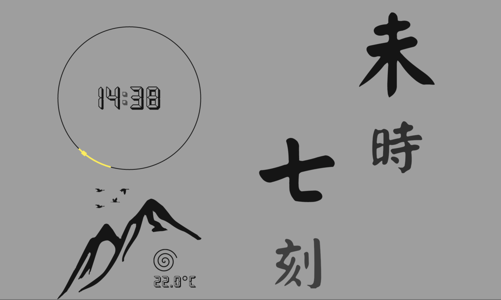

# Shi-Ke Clock

Shi-Ke Clock is an integration of calligraphy art & modern technology. It provide you with traditional Chinese timekeeping symbol which was written in beautiful calligraphic characters and Zen-style decoration. In the meantime, a convenient digital format time representation and weather condition information were retained.

## Web Version

[shike.today](https://shike.today/)

## Introducation of traditional Chinese timekeeping system

The Shi-Ke(時-刻) system is derived from the position of the sun. Each Shi(時/时) was ​1⁄12 of the time between one midnight and the next, making it roughly double the modern hour. This first Shi of a day occurred from 23:00 to 01:00 on the 24-hour clock. Each Shi has one special name, there are 子, 丑, 寅, 卯, 辰, 巳, 午, 未, 申, 酉, 戌, 亥. Each Ke(刻) was 1/8 of the roughly Shi, counted from 1 up to 8. In Chinese numbers, 1 to 8 was written as 一, 二, 三, 四, 五, 六, 七, 八.

The left top corner of Shi-Ke Clock was a circle around the digital time representation. The full circle represent time in a whole day, there was a highlighted part in the circle to indicate current Shi-Ke of the day.

The left bottom corner of Shi-Ke was a Zen-style decoration. An abstract mountain was the main part, there were weather conditions and temperature information in the foot of the mountain and there were birds above the mountain. Every day these birds will fly over the mountain higher and higher in every Shi and in every Ke.

